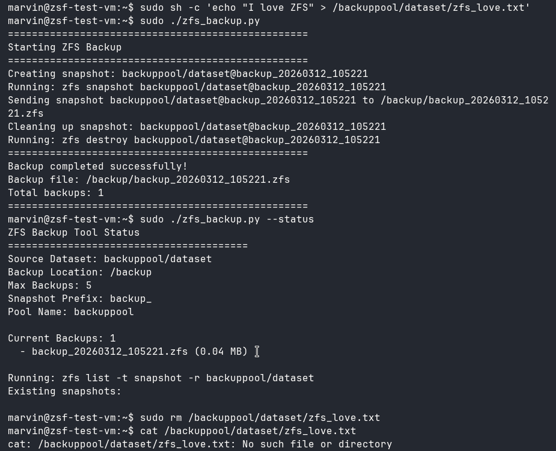
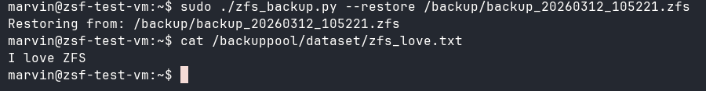
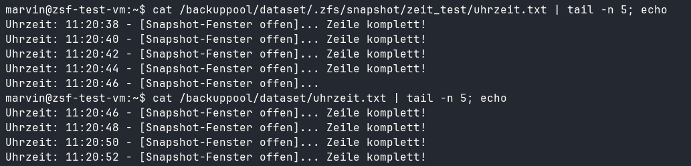
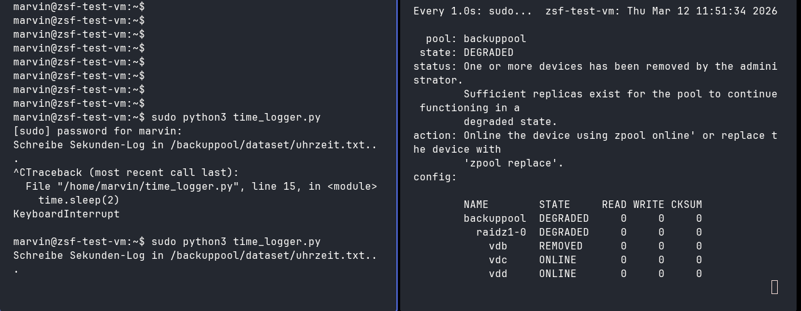
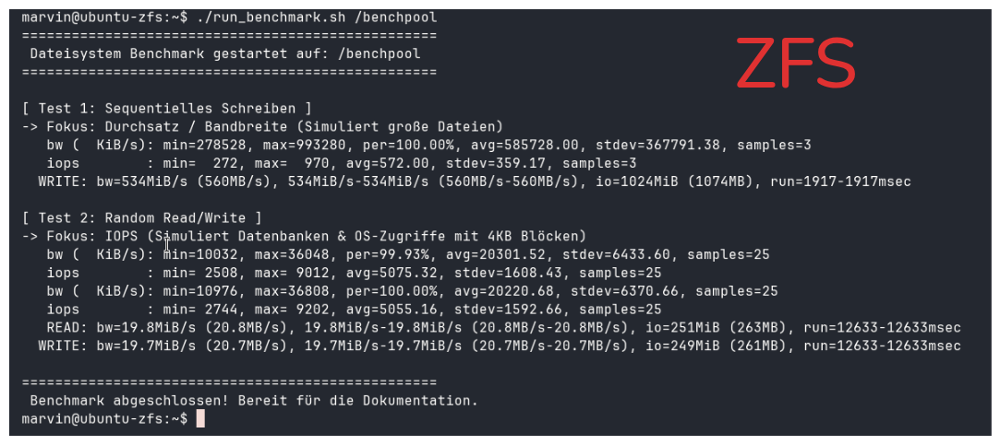
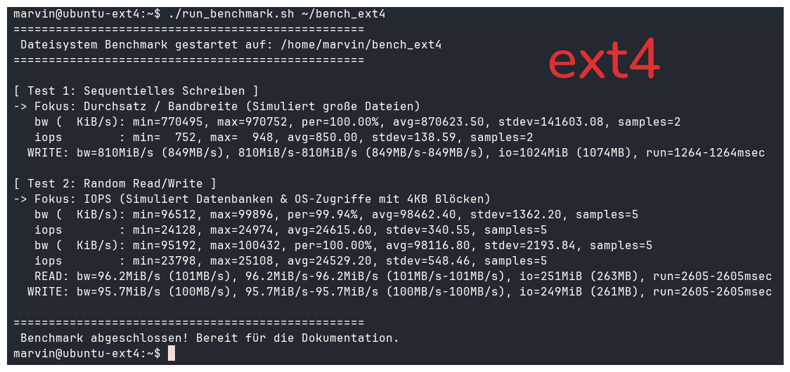

# Ergebnisbericht: Abgabe 3 - Betriebsysteme VL Uni Trier WS 25/26 - Marvin Mokleke - 1779643

## Generelles

Zur Arbeit mit dem ZFS-Dateisystem hab ich mithilfe von Linux' `virt-manager` eine virtuelle Maschine mit dem Ubuntu Server 24.04.4-Image erstellt. Über SSH habe ich mich dann von meinem Host-Systems mit der VM verbunden und die notwendigen Pakete installiert sowie Dateien übertragen.

## Aufgabe 1

Zur Erstellung von Sicherungen hab ich in Zusammenarbeit mit der KI meines Vertrauens ein Python-Skript geschrieben, welches die ZFS-Befehle über `subprocess.run` ausführt. Folgende Parameter können über eine `config.json` angepasst werden: `source_dataset`, `backup_location`, `max_backups`, `snapshot_prefix` und `pool_name`. Ich habe hier direkt ab Aufgabe 1 mit einem ZFS-Pool gearbeitet; dafür habe ich der VM insgesamt 4 weitere 5-GB-Platten hinzugefügt und mit `zpool create backuppool raidz /dev/vdb /dev/vdc /dev/vdd /dev/vde` einen Pool erstellt.

Bei Ausführung des Skripts erstellt es automatisch Snapshots des in der `config.json` angegebenen Datasets, überträgt diese in das Backup-Verzeichnis und verwaltet die Anzahl der Sicherungen entsprechend der Konfiguration. Es bietet auch die Möglichkeit, Sicherungen wiederherzustellen und eine Liste aller vorhandenen Snapshots anzuzeigen.

Das Skript kann mit folgenden Flags ausgeführt werden:

```bash
usage: zfs_backup.py [-h] [--config CONFIG] [--create-config] [--status] [--restore FILE] [--list-snapshots]

ZFS Backup and Archive Tool

options:
  -h, --help        show this help message and exit
  --config CONFIG   Path to config file
  --create-config   Create sample config
  --status          Show status
  --restore FILE    Restore from backup file
  --list-snapshots  List snapshots
```

Testweise habe ich eine Textdatei in dem zu sichernden Dataset erstellt und nach der Sicherung gelöscht. Nach der Wiederherstellung war die Datei wieder vorhanden.

<div style="display: grid; grid-template-columns: 1fr 1fr; gap: 1rem;">
  
  
</div>

## Aufgabe 2

Um eine Bearbeitung während der Snapshot Erstelllung zu simulieren, habe ich ein weiteres kleines Hilfsscript geschrieben: `time_logger.p. Dieses Script schreibt alle 2 Sekunden die aktuelle Zeit in eine neue Zeile einer Textdatei. Dann wartet es 2 Sekunden, bevor es die Zeile als vollständig makiert. Ich habe dieses Script über ein separates Terminal auf der VM laufen lassen, während ich eine Sicherung erstellt habe. Danach habe ich die originale Textdatei mit der im Snapshot gesicherten Version verglichen.

<div style="display: grid; grid-template-columns: 1fr; gap: 1rem; margin-bottom: 1rem;">
  
</div>

Auf dem Bild sieht man, dass der Snapshot nur bis zum Sicherungszeitpunkt geschriebenen Zeiten enthält, während die Zeilen, die nach der Sicherung geschrieben wurden, nicht in der Sicherung enthalten sind. In dem simulierten Beispielfall mit einer Textdatei führt ein ZFS-Snapshot während eines laufenden Schreibvorgangs lediglich zu einem unvollständigen Datenanhang – beispielsweise einem abgeschnittenen Satz oder einer halben Zeile. Die Datei als Ganzes bleibt funktional und kann nach einer Wiederherstellung weiterhin problemlos in einem Editor geöffnet und gelesen werden.

Komplexe Applikationen wie Datenbanken oder virtuelle Maschinen setzen hingegen eine strikte strukturelle und logische Integrität voraus. Wird bei solchen Systemen eine zusammenhängende Transaktion durch den exakten Zeitpunkt des Snapshots genau in der Mitte durchtrennt ("Torn Write"), ist die resultierende Sicherungsdatei in sich logisch defekt. Da der Anwendung beim späteren Einlesen essenzielle Puzzlesteine fehlen, stuft sie das Backup als korrupt ein und verweigert den Dienst oder stürzt ab.

Verhindern könnte man das Problem durch Einfrieren solcher Applikationen während der Snapshot-Erstellung. So könnte man vor der Sicherung mithilfe von Skripten Anwendungen anweisen, alle Daten auf die Festplatte zu schreiben und den Zugriff auf die Dateien zu sperren, bis der Snapshot abgeschlossen ist. Alternativ verfügen moderne relationale Datenbanken über integrierte Transaktionsprotokolle (Write-Ahead Logging). Wird ein logisch inkonsistenter ZFS-Snapshot wiederhergestellt, erkennt die Datenbank beim Start anhand ihres internen Protokolls, dass eine Transaktion durch den Moment des Snapshots abgerissen ist. Sie nutzt dann diese Log-Dateien, um den unvollständigen Vorgang selbstständig und sauber zurückzurollen (Rollback), wodurch die logische Integrität wiederhergestellt wird.

## Aufgabe 3

Zum Test habe ich wieder das `time_logger`-Skript aus Aufgabe 2 verwendet. Ich habe das Skript gestartet, während ich in einer anderen Terminalinstanz den Status des ZFS-Pools mit `watch -n 1 sudo zpool status` überwacht habe. Dann habe ich eine der Platten des Pools in der VM-Konfiguration entfernt. Im Statusüberwachungsfenster konnte ich sofort sehen, wie der Pool in den `DEGRADED`-Zustand wechselt, während das Skript einfach weitergelaufen ist.

<div style="display: grid; grid-template-columns: 1fr; gap: 1rem; margin-bottom: 1rem;">
  
</div>

## Aufagbe 4

Um ein ausgeglichenes Spielfeld zu schaffen, habe ich zwei komplett neue VMs mit identischer Konfiguration erstellt (4 GB RAM, 2 Kerne, 20 GB Platte). Auf der ZFS-VM habe ich einen neuen Pool mit einer 20-GB-Platte erstellt. Auf der ext4-VM habe ich die 20-GB-Platte mit `mkfs.ext4` formatiert und in das Dateisystem eingebunden.
Zum Benchmarking habe ich das `fio` Tool verwendet, welches ich auf beiden VMs installiert habe.

In meinem `run_benchmark`-Skript habe ich zwei Testszenarien konfiguriert. Das Skript simuliert zwei verschiedene, praxisnahe Belastungsszenarien, um sowohl den maximalen Durchsatz (Bandbreite in MB/s) als auch die Verarbeitungsgeschwindigkeit von kleinen Datenblöcken (IOPS) zu messen.

### Test 1: Sequentielles Schreiben (Fokus auf Durchsatz)

Dieser Test simuliert das Speichern großer, zusammenhängender Dateien.

- **`--rw=write`**: Definiert ein rein sequentielles Schreibmuster. Die Daten werden linear und ohne Sprünge auf den Datenträger geschrieben.
- **`--bs=1M`**: Setzt die Blockgröße auf 1 Megabyte. Dies ist ideal, um die maximale Bandbreite der Festplatte und des Dateisystems auszureizen.
- **`--size=1G`**: Es wird insgesamt eine Datenmenge von 1 Gigabyte geschrieben, um den Cache des Systems zu füllen und realistische Werte zu erhalten.
- **`--numjobs=1`**: Der Vorgang wird von einem einzelnen Prozess (Thread) ausgeführt.

### Test 2: Zufällige Lese- und Schreibzugriffe (Fokus auf IOPS)

Dieser Test ist der kritischste Teil des Vergleichs. Er simuliert das typische Verhalten von Betriebssystemen, virtuellen Maschinen oder relationalen Datenbanken, bei denen permanent winzige Datenmengen kreuz und quer auf der Festplatte gelesen und geändert werden.

- **`--rw=randrw`**: Definiert ein zufälliges Muster aus Lese- und Schreibzugriffen.
- **`--bs=4k`**: Setzt die Blockgröße auf 4 Kilobyte. Standard-Blockgröße der meisten Betriebssysteme. Hier muss das Dateisystem maximalen Verwaltungsaufwand betreiben.
- **`--size=500M`**: Es werden 500 Megabyte an zufälligen Daten verarbeitet.
- **`--numjobs=1`**: Auch hier arbeitet ein einzelner Thread, um die reine Effizienz der Dateisystem-Architektur (Journaling bei ext4 vs. Copy-on-Write und Prüfsummen bei ZFS) messbar zu machen.

<div style="display: grid; grid-template-columns: 1fr 1fr; gap: 1rem;">
  
  
</div>

Die durchgeführten Leistungstests mit dem Werkzeug `fio` zeigen ein klares und architektonisch begründbares Leistungsgefälle zwischen den beiden Dateisystemen ext4 und ZFS.

**Ergebnisse im sequentiellen Durchsatz (Test 1)**
<br>
Beim sequentiellen Schreiben großer Datenmengen (1 Megabyte Blockgröße) erreichte das ext4-Dateisystem einen Durchsatz von 810 MiB/s, während ZFS mit 534 MiB/s messbar langsamer agierte. Das klassische Journaling-Dateisystem ext4 profitiert hier von seiner direkten, linearen Schreibmethode, während ZFS zusätzliche CPU-Zyklen für die Allokation neuer Blöcke und die Echtzeit-Berechnung von Prüfsummen benötigt.

**Ergebnisse bei zufälligen Zugriffen (Test 2)**
<br>
Der Stresstest mit zufälligen Lese- und Schreibzugriffen in 4-Kilobyte-Blöcken verdeutlicht die konzeptionellen Unterschiede am stärksten. Hier erreichte ext4 durchschnittlich 24.500 IOPS bei einer Bandbreite von knapp 96 MiB/s. ZFS lieferte im selben Szenario lediglich rund 5.000 IOPS bei knapp 20 MiB/s.

**Fazit des Systemvergleichs**
<br>
Die Messwerte belegen, dass ext4 in Szenarien, die auf maximale Rohleistung und hohe IOPS-Raten angewiesen sind, überlegen ist. ZFS erkauft sich seine weitreichenden Enterprise-Funktionen (wie Copy-on-Write, Schutz vor unerkannter Datenkorruption und verlustfreie Snapshots) durch einen signifikanten Overhead. Besonders bei kleinen, zufälligen Schreibvorgängen führt der Zwang, Daten an neuen Orten zu speichern und Metadaten-Bäume inklusive Prüfsummen permanent neu aufzubauen, zu starken Leistungseinbußen gegenüber herkömmlichen "In-Place"-Dateisystemen.
